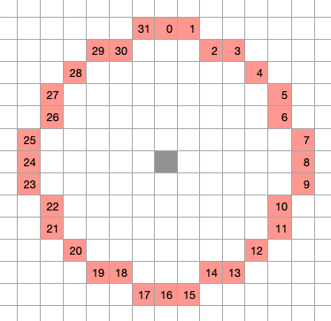
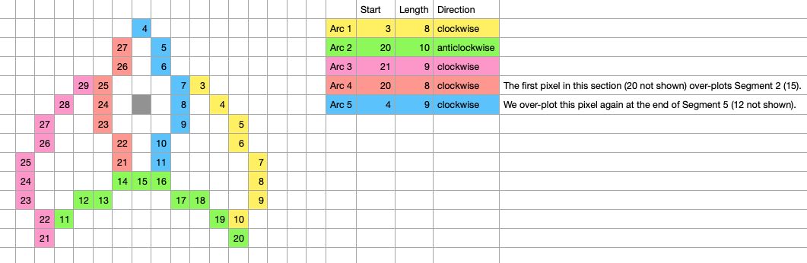
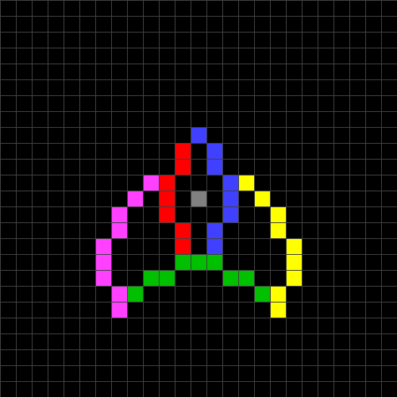
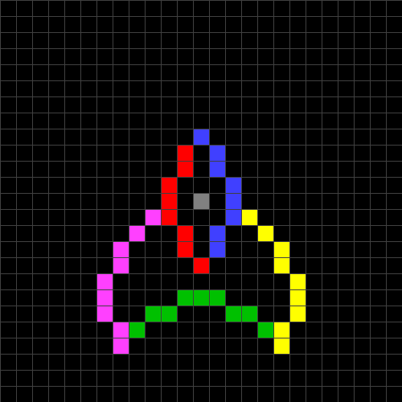
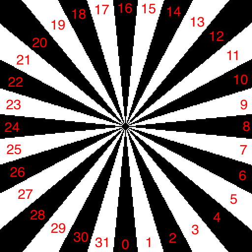

# Starship Command 2022 Edition (for the BBC Micro and Electron)

This is an update to the original 1983 Acornsoft game *Starship Command* by Peter Irvin.

As always, nothing written here is meant to denigrate the original work from 1983, which remains a remarkable achievement in the world before such things as the Internet, source control, fast reliable storage media, extensive information and a community about the inner workings of the BBC Micro, etc. It all just highlights the benefits we have today.

This new version features:

* Significantly faster, more responsive play (less slow-down).
* Reduced flicker.
* More enemy ship designs (was two, now six).
* More starship designs (was eight, now eleven).
* Uses standard keys Z X / : and RETURN. (the original keys still work too)
* A slightly less harsh difficulty ramp on the first two commands (enemies are slower at the start, gradually ramping up to regular speed as the number of enemies killed goes up). This change is to help new players, and perhaps to help compensate for difficulty added due to the faster speed of the game.
* Rotational dampers on by default, with the setting remembered between commands and games.
* Enhanced reporting/awards at the end of each command/game.
* Master compatible (fixes the scanner static).
* Electron version - many thanks to [0xC0DE](https://twitter.com/0xC0DE6502) for making the required changes.

## Technical Changes

The work here was based originally on the excellent [Level 7 disassembly]( http://www.level7.org.uk/miscellany/starship-command-disassembly.txt).

### Plotting enemies
Unusually, each enemy is plotted using a pixel plotting routine, not a sprite plotting routine as in most games. It makes sense for this game since each enemy can be rotated at 32 different angles, which would be a lot of sprite memory.

Enemies are drawn using arcs of this circle:



The regular enemy design is this (colours show the arcs from the circle above):



For the most part, each arc continues drawing from where the last arc left off. Having drawn the last point of arc 1 (yellow), the position is moved from point 10 on the circle down one to point 11. This is where the next arc (green) starts plotting. The second arc is a special case in that it goes anticlockwise in a logical but unintuitive manner:

Having drawn the first point, it uses the offset from point 20 on the circle to 21 to offset the current position (up and to the left in this case), but then decrements the current point number from 20 to 19 to calculate the next offset.

Another wrinkle in the plotting is that two of the arcs require a move to a new starting point (i.e. Arc 1 and Arc 4). They don't start directly at the end of a previous arc. These offsets are calculated in code in the original game.

Continuing this way it draws the entire enemy.

To rotate the enemy clockwise, increment the starting point of each arc around the circle one position. In this way we can draw the enemy in any of 32 different rotations with only one enemy definition.

There are two enemy types in the original game. The second is similar to the first but with a different start position for Arc 4, which is also hardcoded.

### Adding new enemies
To add new enemy designs much of the above had to be generalised. The trick of incrementing the starting point to rotate the enemy doesn't work well in general for other designs, producing poor looking results.

Better results are obtained by hand-drawing different orientations. So it seems like we need 32 different definitions of each enemy. That's a lot of memory. Instead, we define just the first five rotations (0-45 degrees) for each enemy. At the beginning of a new command, we use reflection and rotation to create equivalent definitions for all 32 angles from the first five, writing into a cache. The number of enemies in each command is two, so we only need two full size caches.



The enemies are still drawn using arcs of the circle, but where the original used five arcs, there can now be a different number of arcs per enemy (in practice we use 5 or 6). Each arc also has a start point (x,y) to move to before starting plotting the arc.

A five arc enemy takes 100 bytes to define, and a six arc enemy takes 120 bytes.



### Looking at the starship
One thing the enemies do a lot is rotate themselves to point at your Starship before starting to fire. Given the (x,y) position on screen of an enemy (relative to your Starship) the code needs to work out which of the 32 angles is desired.

In this picture, the number in red is the result we are looking for when inside the black or white segment:



In maths terms this is the atan2(y,x) function. Not so easy for a humble 6502. But we can simplify given that we have a limited number of angles. Firstly, by symmetry we can assume the angle is 0-45 degrees.

In the original game the remaining calculation is done by a 12 bit division y/x to find a slope which is then tested against predetermined values to find the appropriate angle.

In this updated version of the game we instead calculate kx for some fixed constants k (we have a very fast multiply, see below), and compare each against y. This is in effect testing if y/x < k, i.e. the slope is less than the constants.

### Fast multiply
A fast multiply routine is a key part of the increase in speed. The original game has a several multiply routines: 3 bit, 5 bit, 8 bit, 16 bit and 24 bit.

Every star, torpedo, enemy ship, explosion fragment, etc rotates around the player ship. So when the game gets busy, lot of rotations means lots of multiplications:

    X' = Y*sine + X*cosine
    Y' = X*cosine - Y*sine

By stuffing all available RAM with code/data (e.g. the lower half of page 1 holds the highscore table) and compressing the text (see below), enough memory has been freed to allow for a very fast modern multiply routine. The code itself is not large, but it uses a full 2K of tables of squares.

Moreover, if the same angle of rotation is used repeatedly (as here), the multiplication routine gets faster still, basically reducing to four table look ups and two subtracts. Self modifying code is used. It is inlined for speed.

See [here](https://codebase64.org/doku.php?id=base:seriously_fast_multiplication) for details.

### Fast pixel plotting
Every star, torpedo, enemy ship, and explosion is drawn from individual pixels. This is the single most expensive function in the game. So making this fast is also key to the speed increase.

The play area is 256x256 pixels, so all coordinates are eight bit values, and this simplifies calculating the screen address.

The original code calculates the screen address and plots in a fairly standard way with shifts and 'and's:

```
eor_pixel
    lda #0
    sta screen_address_low
    lda y_pixels
    lsr
    lsr
    lsr
    sta screen_address_high
    lsr
    ror screen_address_low
    lsr
    ror screen_address_low
    adc screen_address_high
    adc screen_start_high
    sta screen_address_high
    lda y_pixels
    and #7
    adc screen_address_low
    sta screen_address_low
    lda x_pixels
    and #$f8
    tay
    lda x_pixels
    and #7
    tax
    lda bit_table,x
    eor (screen_address_low),y
    sta (screen_address_low),y
    rts
```

The new code uses 1k of table lookups to help do the same thing, but quicker:

```
eor_play_area_pixel
    ldy y_pixels
    lda play_area_row_table_high,y                 ; table lookup
    sta screen_address_high
    lda row_table_low,y                            ; table lookup
    sta screen_address_low
    ldy xandf8,x                                   ; table lookup
    lda xbit_table,x                               ; table lookup
    eor (screen_address_low),y
    sta (screen_address_low),y
    rts
```

Note that in this new version, the X register holds x_pixels, and is preserved across calls.

### Fast arc plotting
We have a routine that draws an entire circle, pixel by pixel. It is an unrolled loop. We jump into this routine at the appropriate starting point for the arc we want to draw, having already modified the code to write an RTS instruction at the point we want to stop drawing. This (a) minimises the cycle cost of working out what coordinates to incement or decrement to get the the next pixel and (b) also removes the overhead of a loop counter and branch instruction.

In fact it draws more than one complete circle, so you can join just at the end of one circle and still draw an arc of reasonable length. This fits into one page of memory, for easier/quicker self modification.

```
plus_angle0
    jsr eor_play_area_pixel
    inx
plus_angle1
    jsr eor_play_area_pixel
    inx
    inc y_pixels
plus_angle2
    ...
plus_angle41
    jsr eor_play_area_pixel
    dex
    inc y_pixels
plus_angle42
    rts
```

### The secret bonus
Just before your command is judged by Star-Fleet, a secret random bonus of 0-39 is added to your score. This luck can make all the difference as to whether you get another command. With bonus added:

|  Score Range   | Star-Fleet are said to be...                                       |
| -------------- | ------------------------------------------------------------------ |
|     0 -  39    | furious,      and they retire you from active service              |
|    40 -  59    | displeased,   and they retire you from active service              |
|    60 -  79    | disappointed, and they retire you from active service              |
|    80 - 139    | disappointed, but they allow you the command of another starship   |
|   140 - 259    | satisfied,    and they allow you the command of another starship   |
|   260 - 399    | pleased,      and they allow you the command of another starship   |
|   400 - 599    | impressed,    and they allow you the command of another starship   |
|      600+      | delighted,    and they allow you the command of another starship   |

The implementation of the bonus score is a little eccentric, in that it adds a random binary number between $00-$3f to your score stored as a binary coded decimal. The result is therefore no longer a BCD number (since it may now contain hex digits outside the range 0-9). The practical upshot of this quirk is minor: the probability of another command increases as four increasing linear sections with small steps up at each multiple of ten in score:

| Score without bonus | Probability of another command  |
| ------------------- | ------------------------------- |
| 40 or less          | 0%                              |
| 41                  | 1/64 = 1.6%                     |
| 42                  | 2/64 = 3.1%                     |
| 43                  | 3/64 = 4.7%                     |
| ...                 | ...                             |
| 49                  | 9/64 = 14.1%                    |
| 50                  | 16/64 = 25.0%                   |
| 51                  | 17/64 = 26.6%                   |
| 52                  | 18/64 = 28.1%                   |
| ...                 | ...                             |
| 59                  | 25/64 = 39.1%                   |
| 60                  | 32/64 = 50.0%                   |
| 61                  | 33/64 = 51.6%                   |
| ...                 | ...                             |
| 69                  | 41/64 = 64.1%                   |
| 70                  | 48/64 = 75%                     |
| 71                  | 49/64 = 76.6%                   |
| ...                 | ...                             |
| 79                  | 57/64 = 89.1%                   |
| 80 or more          | 100%                            |

In summary: If you score 80 points, you definitely get another command. At 60 points you have a 50% chance of another command. Anything 40 or below is a lost cause - no bonus will be enough for another command.

All of this is unchanged from the original game, but is interesting to document.

### The new awards system
There are ten different possible Star-Fleet reactions at the end of the game if you live, and another ten outcomes if you die. There is no random bonus here, it's based purely on your total score:
```
"After reviewing your ADJECTIVE career, Star-Fleet OUTCOME."

ADJECTIVE:

if only one command: "all-too brief"
if only two commands: "short"
if three to four: "fairly short"
if five to six: "fairly long"
seven to nine: "long"
else "distinguished"

OUTCOME IF YOU DIE:

1. list your name on the Pluto monument
2. mention you in a tri-vi broadcast
3. award you the Order of the Badger
4. award you the Order of the Lion, Second Class
5. award you the Order of the Lion, First Class
6. award you the Order of the Lion, First Class, with Oak Leaves
7. award you the Order of the Lion, First Class, with Oak Leaves and Crossed Blasters
8. put your face on recruiting posters
9. build a statue of you on Mars
10. rename the Academy after you

OUTCOME IF YOU ESCAPE IN POD:

1. court-martial you for cowardice
2. demote you to worker grade
3. retrain you as a gardener
4. assign you to planning staff
5. grant you a full pension
6. promote you to Commodore
7. promote you to Rear-Admiral
8. promote you to Admiral
9. promote you to Grand Admiral
10. elect you President of the Solar Federation
```

### Compressing text
There is around 2k of text in Starship Command. The text is compressed to save memory.

Each string starts with one byte of length (number of encoded bytes before the next string), followed by a bitstream. The most common characters in the text are stored in 5 bits as values 0-30. Value 31 indicates that a less common character follows in the next 8 bits. Once decoded, a character 'c' of 128 or higher indicates string c-128 should be inserted at this point. In this way common words or phrases can be duplicated cheaply.

Some strings don't compress well, containing too many unusual characters. These are stored in a separate set of regular (uncompressed) strings.

### Keyboard clash
Having added / : and RETURN as keys, pressing combinations of these keys also generates a COPY key output (due to the limitations of the keyboard matrix), which unwantedly pauses the game. This did not happen in emulation, but did on a real BBC Micro. So the pause function is now on the P key (SPACE to unpause), and all is well again.

### Master compatible
The original game is mostly already compatible with the Master. The one issue noticed is the scanner static display which doesn't look right on the Master. The original game read 'random' byte information from the OS at $d000, but this doesn't look right on the Master. So instead the 'randomness' is now taken from bytes within the program itself.

## Final thoughts
It is subjective of course, but I've always had a soft spot for Starship Command. It has unique elements that make it stand out from the herd. The explosions look great with a full particle system going on, with pieces rotating away. The way you can spray bullets around is very satisfying, and the physics are very believable. The thin layer of narrative surrounding the gameplay also adds something to the game.

I believe this updated version retains the spirit of the original game, but improves the speed and responsiveness, with a few bells and whistles added. Now I must be going, the frontiers of space need defending...

TobyLobster

## Thanks
* Thanks to Adrian Nelson for the new enemy designs and a new Starship design.
* Thanks to Graham Nelson for the logic and wording of the new awards system.
* And to both for useful feedback and play testing.
* Thanks to Level 7 for the excellent [disassembly](http://www.level7.org.uk/miscellany/starship-command-disassembly.txt) that started this.
* Thanks to [0xC0DE](https://twitter.com/0xC0DE6502) for making the required changes for the Electron.
